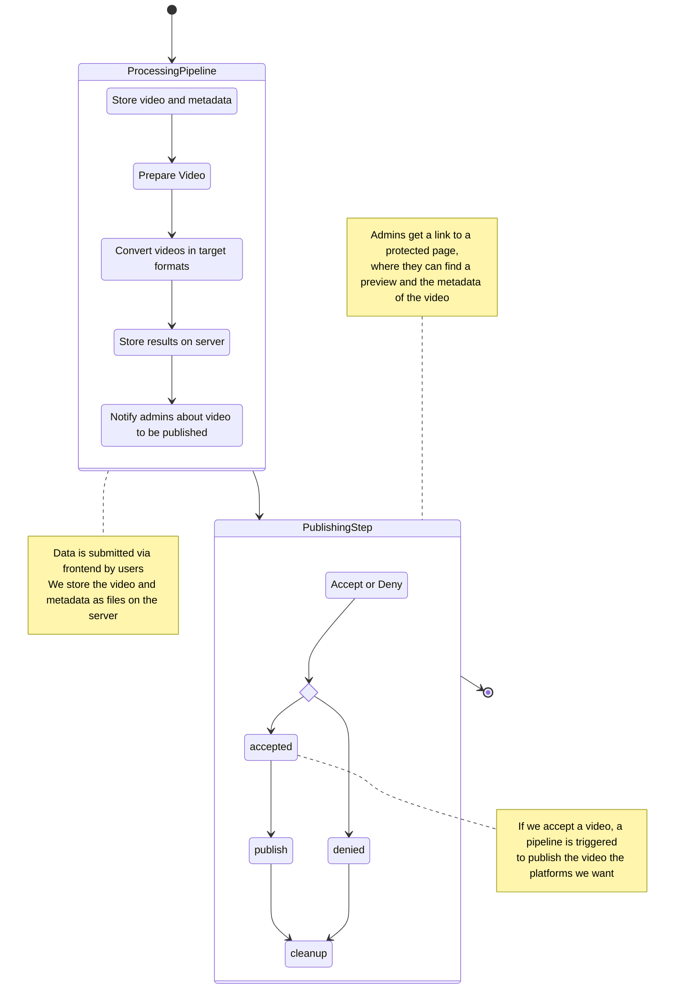

# videopipeline
a service to upload and process videos towards media.freifunk.net

```mermaid
stateDiagram-v2
    [*] --> ProcessingPipeline
    note right of ProcessingPipeline
        Data is submitted via frontend by users
        We store the video and metadata as files on the server
    end note
    state ProcessingPipeline {
        state "Store video and metadata" as STORE
        state "Prepare Video" as PREPARE
        state "Convert videos in target formats" as PROCESS
        state "Store results on server" as RESULTS
        state "Notify admins about video to be published" as NOTIFY
        STORE --> PREPARE
        PREPARE --> PROCESS
        PROCESS --> RESULTS
        RESULTS --> NOTIFY
    }
    state PublishingStep {
        state "Accept or Deny" as ACCEPTANCE
        state choice <<choice>>
        ACCEPTANCE --> choice
        choice --> accepted
        choice --> denied
        accepted --> publish
        note right of accepted
            If we accept a video, a pipeline is triggered
            to publish the video the platforms we want
        end note
        publish --> cleanup
        denied --> cleanup
    }
    ProcessingPipeline --> PublishingStep
    note left of PublishingStep
        Admins get a link to a protected page,
        where they can find a preview and the metadata of the video
    end note

    PublishingStep --> [*]

    

```
